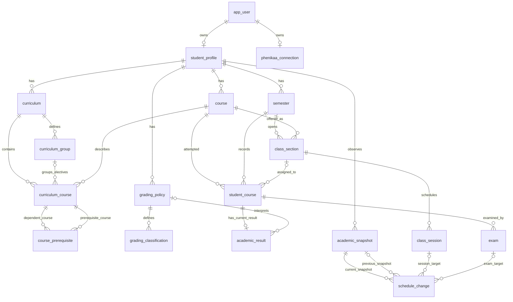

# Domain và database học vụ

## Phạm vi hiện tại

Phase 2 đã tạo model học vụ chuẩn hóa. Phase 4B thêm kết nối Phenikaa mã hóa và use case nhập hồ sơ; lịch mới được đọc thành observation, chưa được lưu vì thiếu liên kết nguồn đáng tin cậy. Chưa có API CRUD học vụ, bộ tính GPA hoặc change detection engine.

## Ownership và persistence

Một `StudentProfile` thuộc một `app_user` qua `user_id` unique. Hồ sơ không tự tạo lúc đăng ký vì chưa có dữ liệu học vụ. Mỗi user hiện có tối đa một hồ sơ; hỗ trợ nhiều trường/chương trình cho cùng user cần thiết kế riêng sau này.

Catalog, học kỳ, chương trình và chính sách điểm hiện là bản dữ liệu thuộc hồ sơ, không phải catalog dùng chung toàn trường. Hai hồ sơ có thể có cùng mã môn nhưng không dùng chung bản ghi. Cách này chấp nhận trùng dữ liệu để tránh việc lần nhập của người này sửa dữ liệu của người khác khi chưa có cơ chế đối soát nguồn tin cậy.

Mọi entity học vụ có UUID nội bộ. Các quan hệ dùng UUID trong JPA và khóa ngoại trong PostgreSQL; không dựng graph `ManyToMany` hoặc cascade xóa cả hồ sơ. Khóa ngoại ghép `(profile_id, parent_id)` buộc cha/con cùng hồ sơ. `grading_classification` nhận ownership thông qua policy. Các quan hệ thêm điều kiện môn/học kỳ/chương trình cũng được kiểm tra ở database.

Phase 4B thêm repository cho kết nối và hồ sơ, cùng application service nhập hồ sơ theo user. Các domain còn lại chưa có repository/CRUD khi chưa có use case. Integration test dùng EntityManager để kiểm tra mapping và truy vấn identity. Khi triển khai import quan hệ cha/con, cần lưu cha trước con trong transaction vì JPA đang giữ ID thay vì association tự sắp xếp insert. Chọn curriculum/policy cho hồ sơ sau khi đã lưu các bản ghi đó. FK mặc định ngăn xóa cha còn được tham chiếu, không âm thầm mất lịch sử.

## Quan hệ chính

`student_profile.curriculum_id` và `grading_policy_id` là lựa chọn hiện tại, nullable và chỉ trỏ tới bản ghi của chính hồ sơ. Mỗi change có đúng một target: session hoặc exam; ERD không biểu diễn được ràng buộc XOR này nên migration có CHECK riêng.

## Môn học, lớp mở và lần học

- `Course`: định nghĩa môn, mã, tên, tín chỉ. Không chứa trạng thái qua môn hoặc điểm của sinh viên.
- `Semester`: năm bắt đầu niên khóa và mã đợt học. Ví dụ `(2026, T1)` có mã hiển thị `2026-2027:T1`; `SUMMER` là một term độc lập. Không suy niên khóa từ ngày bắt đầu học. Adapter sau này phải ánh xạ mã nguồn sang quy ước này.
- `ClassSection`: một lớp của một môn trong một học kỳ. Unique theo hồ sơ + học kỳ + môn + mã lớp.
- `StudentCourse`: một lần học của sinh viên; số lần học dương, unique theo hồ sơ + môn + attempt number, không ghi đè lần trước. Section có thể chưa biết; nếu có, FK bắt buộc khớp môn và học kỳ.
- Tín chỉ dùng `BigDecimal`/`NUMERIC`, không dùng float. CurriculumCourse và StudentCourse giữ số tín chỉ tại chương trình/lần học, không suy ngược từ catalog có thể được cập nhật.

## Identity buổi học và lịch thi

`ClassSession` có UUID và unique `(profile_id, section_id, occurrence_key)`. `occurrence_key` là khóa lần học đã chuẩn hóa, ví dụ thứ tự buổi học ổn định trong lớp, hoặc khóa được giữ lại từ lần nhập đầu. Không dùng ngày, giờ, phòng, giảng viên hoặc vị trí tạm thời trong danh sách làm identity.

Khi đối chiếu lại dữ liệu, tìm theo bộ khóa trên rồi gọi `reschedule`; UUID và occurrence key không thay đổi. Đổi phòng/giờ không tạo buổi mới. `@Version` phát hiện ghi đè từ bản dữ liệu cũ. Hủy buổi học giữ bản ghi ở trạng thái `CANCELLED`, không xóa để còn tham chiếu change.

`Exam` tách khỏi ClassSession, gắn với StudentCourse vì nhóm thi có thể khác lớp học. Unique `(profile_id, student_course_id, occurrence_key)` cho phép nhiều bài thi/lần thi trong cùng lần học. Lịch thi cũng có version và identity không đổi khi đổi giờ/phòng.

Schema không tự giải quyết bài toán nguồn thiếu identity. Connector phải duy trì mapping hoặc đối soát có kiểm soát; không được lấy hash của giờ/phòng rồi gọi đó là khóa ổn định. Hiện đã đọc được lịch nguồn qua HTTP nhưng chưa có thuật toán đối soát, bảng source mapping hoặc import lịch.

## Chương trình và điều kiện học

Curriculum unique theo hồ sơ + mã + revision; cohort là metadata tùy chọn. `minimum_credits` là yêu cầu tổng tín chỉ. CurriculumCourse phân biệt `REQUIRED` và `ELECTIVE`; elective bắt buộc thuộc một CurriculumGroup có mức tín chỉ tối thiểu riêng. Một môn chỉ xuất hiện một lần trong cùng curriculum để tránh tự động đếm đôi giữa các nhóm.

CoursePrerequisite liên kết hai môn cùng curriculum, phân biệt `PREREQUISITE` và `COREQUISITE`. Các điều kiện tiên quyết được hiểu là AND; chưa có nhóm OR, môn tương đương hoặc điều kiện điểm tối thiểu. Database chặn quan hệ tự tham chiếu và bản ghi trùng. `validateAcyclic` kiểm tra chu trình tiên quyết trong toàn bộ tập quan hệ của một curriculum; corequisite không tham gia đồ thị thứ tự học. Use case import sau này phải gọi kiểm tra này trong transaction và kiểm soát cập nhật đồng thời; FK/CHECK không tự ngăn chu trình nhiều cạnh.

## Kết quả và chính sách điểm

AcademicResult là kết quả hiện tại của một StudentCourse, không phải lịch sử từng lần sửa điểm. Trạng thái có `IN_PROGRESS`, `PASSED`, `FAILED`, `WITHDRAWN`, `EXEMPTED`. Chưa có kết quả thì có thể chưa có hàng AcademicResult; đang học có thể lưu hàng IN_PROGRESS với điểm null, không biến điểm chưa biết thành 0.

Mỗi kết quả lưu điểm số, điểm chữ, grade points, tín chỉ đăng ký/đạt, thời điểm ghi nhận và cờ `included_in_gpa`. FK ghép bảo đảm tín chỉ đăng ký khớp StudentCourse. Failed/in-progress/withdrawn không được có tín chỉ đạt. Chỉ passed/failed có thể đưa vào GPA, và phải có grade points cùng policy rõ ràng. Miễn học có thể đạt tín chỉ nhưng không mặc nhiên được tính GPA.

GradingPolicy có mã + revision, thang điểm số, thang grade points, chiến lược chọn lần học (`LATEST`, `HIGHEST`, `ALL`) và các nhãn xếp loại/ngưỡng GPA cấu hình. Không seed chính sách hoặc ngưỡng Khá/Giỏi/Xuất sắc. Model cho phép thang điểm khác 10/4; fixture kiểm thử dùng 20/5 để tránh mặc định ngầm.

Policy được xem là bất biến theo revision trong Hibernate; thay chính sách phải tạo revision mới. Kết quả giữ policy riêng, không bị diễn giải lại chỉ vì hồ sơ đổi lựa chọn hiện tại. Constructor kiểm tra điểm/ngưỡng không vượt thang policy; database kiểm tra số không âm và FK nhưng chưa có trigger kiểm tra giới hạn liên bảng. Không ghi SQL trực tiếp để bỏ qua các quy tắc domain.

Chưa có công thức quy đổi điểm, làm tròn, đánh giá tốt nghiệp hoặc tính GPA. Bộ tính sau này phải xử lý lần học lại theo policy và không cộng lặp tín chỉ hoàn thành của cùng môn. Các trường hiện tại là dữ liệu đầu vào, không phải kết quả GPA đã tính.

## Snapshot và thay đổi lịch

`AcademicSnapshot` là DTO contract đã chuẩn hóa, tách catalog/section/attempt/session/exam, không chứa selector HTML hoặc tên field riêng của nhà cung cấp. `AcademicSnapshotMetadata` ánh xạ bảng `academic_snapshot`: nguồn dạng mã chung, thời điểm thu thập, phiên bản schema, trạng thái COMPLETE/PARTIAL/FAILED và SHA-256 của nội dung chuẩn hóa khi có nội dung. Metadata không chứa credential, raw HTML hoặc raw response.

ScheduleChange lưu target UUID nội bộ, snapshot trước/sau, loại thay đổi và các giá trị trước/sau dưới dạng JSON object. Partial unique index chống ghi trùng cùng snapshot + target + change type. Factory chỉ nhận snapshot COMPLETE cùng nguồn/cùng hồ sơ; snapshot trước có thể null ở lần quan sát đầu. Snapshot và change được đánh dấu bất biến ở Hibernate, không phải cơ chế lưu trữ WORM của database.

Chưa lưu payload snapshot đầy đủ hoặc tự tính hash/diff. Metadata và before/after của change không đủ tái dựng toàn bộ snapshot. Chưa phát event, gửi email hoặc ghi Google Calendar.

## Nullability, constraint và index

| Nhóm dữ liệu | Quy tắc và lý do |
| --- | --- |
| Profile | Student number, trường, chương trình, cohort và lựa chọn curriculum/policy có thể null vì chưa thu thập; user ID bắt buộc và unique |
| Semester | Cặp ngày có thể cùng null khi chưa biết lịch; nếu có phải đủ hai ngày và cuối không trước đầu |
| Curriculum | Cohort/recommended term tùy chọn; group ID chỉ có cho elective; mã + revision bắt buộc để phân biệt phiên bản |
| StudentCourse | Section nullable để lưu bảng điểm cũ không có thông tin lớp; môn/học kỳ/attempt/tín chỉ bắt buộc |
| AcademicResult | Điểm số/chữ/grade points và policy có thể chưa biết; không được bật tính GPA nếu thiếu grade points/policy; tín chỉ đạt không vượt đăng ký |
| Schedule | Room/lecturer/format có thể chưa công bố. Session bắt buộc đủ start/end; exam cho phép thiếu end. Không bịa giờ để hoàn thiện dữ liệu |
| Snapshot/change | FAILED cho phép thiếu content hash; previous snapshot nullable ở lần đầu; đúng một target và current snapshot luôn bắt buộc |

Unique index phục vụ cả chống trùng và tra cứu theo owner/identity. Index thêm cho lịch theo thời gian, kết quả theo trạng thái, snapshot theo nguồn/thời điểm, lịch sử change và chiều tham chiếu ngược của FK. Không thêm index riêng trùng prefix của unique index đã có. Các ID bắt buộc có FK; không dùng text ID đa hình cho target change.

## Migration và kiểm thử

- V3: hồ sơ, catalog, curriculum/prerequisite, grading policy/classification.
- V4: lớp mở, lần học, kết quả, buổi học và kỳ thi.
- V5: snapshot metadata và schedule change.
- V6: kết nối Phenikaa mã hóa, ownership và trạng thái truy cập.

V1/V2 giữ nguyên; `ddl-auto=validate` giữ nguyên. Migration không seed học vụ hoặc sao chép dữ liệu cá nhân. Kiểm thử bao gồm database sạch, nâng cấp V2 → V5 giữ nguyên account/settings, chạy lại không tạo migration trùng, mapping tất cả entity, JSONB/decimal/time, constraint/ownership và optimistic locking. Test dùng dữ liệu tổng hợp `@example.test`, không dùng tài khoản trường.

## Kết nối Phenikaa và nhập hồ sơ

`phenikaa_connection` có UUID nội bộ, `user_id` bắt buộc/unique và FK tới `app_user`. Một user có một hàng kết nối kể cả khi đã ngắt; kết nối lại giữ UUID cũ. Unique index đủ phục vụ tra cứu theo user, không thêm index trùng mục đích. FK không cascade xóa dữ liệu học vụ.

| Cột/nhóm | Quy tắc và lý do |
| --- | --- |
| `status` | Chỉ nhận CONNECTED, RECONNECTION_REQUIRED, DISCONNECTED |
| `encrypted_session` | BYTEA chứa nonce/ciphertext/tag; bắt buộc khi kết nối hoặc cần kết nối lại, phải NULL khi đã ngắt |
| `encrypted_subject` | BYTEA chứa ID người học đã mã hóa, bắt buộc để ngăn kết nối lại bằng tài khoản nguồn khác rồi ghi đè hồ sơ |
| `encryption_key_version` | Số nguyên dương; cùng với phiên bản format và AAD để giải mã đúng ngữ cảnh |
| `session_expires_at` | Nullable vì expiry chưa xác minh; hiện lưu NULL, không đặt hạn giả |
| `last_authenticated_at` | Bắt buộc; chỉ ghi sau khi cấp phiên và kiểm tra hồ sơ thành công |
| `last_successful_access_at` | Lần truy cập thành công gần nhất |
| `last_failed_access_at`, `last_failure_code` | Cùng có hoặc cùng NULL; mã lỗi thuộc danh sách cố định, không có message nguồn |
| `created_at`, `updated_at`, `version` | Timestamp bắt buộc; version phát hiện ghi đè bằng entity cũ |

Hai cột mã hóa dùng AAD có mục đích riêng và ràng buộc user/kết nối; không thể hoán đổi session với subject hoặc chuyển ciphertext sang user khác để sử dụng. Khóa nằm ngoài database/source. [Tài liệu kết nối](phenikaa-integration.md#phase-4b-kết-nối-mã-hóa-và-nhập-hồ-sơ) giải thích định dạng, cấu hình và giới hạn xoay khóa hiện tại.

`StudentProfile` không thêm cột ở phase này. Lượt nhập dùng `user_id` từ kết nối đã kiểm tra, tạo hồ sơ nếu chưa có và giữ UUID khi nhập lại. Hiện chỉ cập nhật mã sinh viên/tên ngành đã xác minh; giá trị nguồn chưa biết không xóa trường cũ. User được khóa trong transaction để nhập lần đầu đồng thời không tạo trùng.

Test V5 → V6 kiểm tra hồ sơ cũ còn nguyên và không sinh seed kết nối. Testcontainers cũng chạy schema sạch với Hibernate validate, constraint owner/unique/ciphertext, nhập lặp/đồng thời, hết phiên, lỗi nguồn, lỗi toàn vẹn và rollback khi ghi thất bại. Chưa có migration source mapping hoặc schedule import vì gate quan hệ nguồn chưa đạt.
